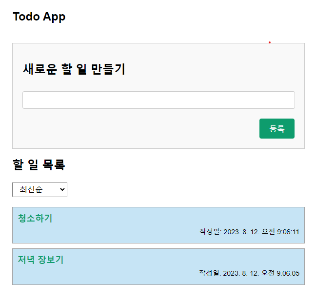

# polycube-challenge-fe
폴리큐브 프론트엔드 사전과제

### 1. React로 To-DO App 구현
- 요구사항<br><br>
  1-1 기술스택<br>
     JS, ES6준수, node v18, React CRA<br><br>
  1-2 구현기능
    - /: 메인페이지
    - /id: 상세 페이지
    - 아이디 (`Number`)
    - 할 일 (`String`)
    - 시간 (`Date`)
    - 메인 페이지에서 To-Do 목록 조회
      - To-Do 시간 기준으로 필터링 기능
      - Recoil에서 To-Do 동기화
      - To-Do 목록에서 To-Do를 클릭하면 아이디 기준으로 상세 페이지로 라우팅
    - 메인 페이지에서 To-Do 생성
      - To-Do는 TextInput과 저장 버튼으로 구성된다.
      - TextInput은 useRef 훅을 사용한 uncontrolled input이다.
      - 생성한 To-Do는 Recoil에 상태 관리 및 동기화
    - 상세 페이지에서 To-Do 수정
      - 선택된 To-Do의 아이디, 할 일, 시간이 보여짐
      - 모든 항목은 수정될 수 있고, 수정되면 Recoil에 동기화 됨
    - 상세 페이지에서 To-Do 삭제
      - Recoil에서 삭제된 데이터 동기화

- 실행 방법
  ```cd todo-app```
  ```npm install```
  ```npm run dev```

- 미리보기<br>
  


### 2. 바닐라 JS로 슬라이드 배너 구현
- 요구사항
    - 각 배너는 3개의 이미지로 구성된다. (지정된 배너 이미지)
    - 이미지는 정적으로 로드하는 것이 아니라 fetch로 가져온다.
    - 배너는 3초마다 자동으로 다음 항목으로 넘어간다.
    - 모바일 환경에서 사용자 터치 동작으로 이전 또는 다음 슬라이드로 넘어간다.
    - DOM 트리가 구성되면 “페이지가 구성되었습니다” 문자열을 콘솔 로그에 남긴다.
    - 배너 이미지 등 모든 리소스가 로드되면 “모든 리소스가 로드되었습니다.” 문자열을 콘솔 로그에 남긴다.

- 실행 방법<br>
  index.html 브라우저에서 열기

- 미리보기<br>
  